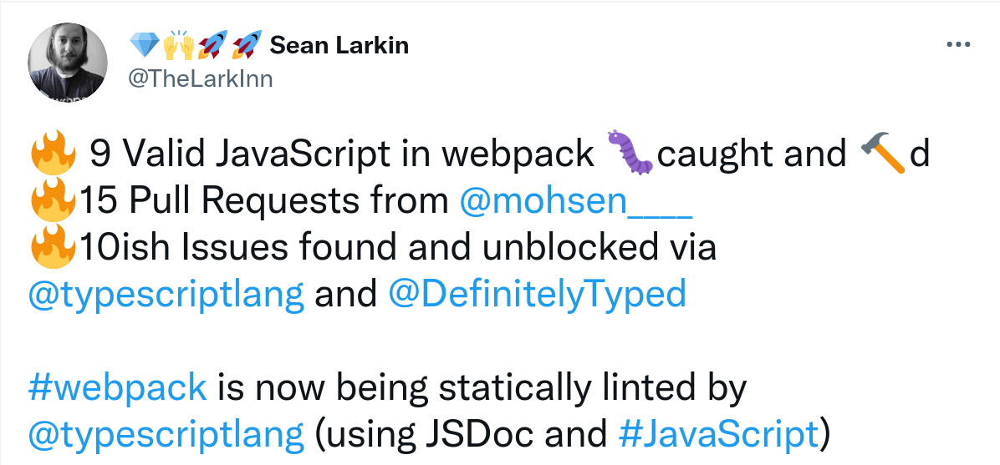

<!-- .slide: data-transition="slide" data-background="./images/typescript-vs-jsdoc-javascript.png"  -->
## TypeScript alternatives:
## JSDoc JavaScript
### [LogRocket](https://www.logrocket.com) with [@johnny_reilly](https://twitter.com/johnny_reilly)

<aside class="notes">
talk to be delivered using VS Code Reveal extension: https://github.com/evilz/vscode-reveal
150% zoom for playground
general welcome
</aside>

---

## `whoami`

- [@johnny_reilly](https://twitter.com/johnny_reilly) ❤️🌻

- Blogging and open-source software

- [contributed `LoaderContext` static typing to webpack](https://github.com/webpack/webpack/pull/13164)

- TypeScript: DefinitelyTyped / ts-loader etc

<aside class="notes">
Hi everyone,

My name is John Reilly and I'm a big fan of TypeScript.

What if I want static typing for my JavaScript and I don't want a build step?
</aside>

---

<aside class="notes">
Classically you would write TypeScript in ts files
And compile to JS files - erasing the type system

that's significant - you don't run your source code,
you run your compiled code
</aside>

### TypeScript = 
### JavaScript + static typing

[Compile TS -> JS](https://www.typescriptlang.org/play?#code/JYOwLgpgTgZghgYwgAgLIoN4ChnJHAWwgC5kBnMKUAcwG4dkBXKAG1IqpDqwF8ssEAexAVkRUumQBeZNlz5xyAOQArQQAsQIAJ5QIwFi21KANA2Ztl6sGAAOZYgHpHAIxaDqAOjWadeg0aeQgRKvPxCIoIsEJ7u1AAUAAao2niEKMBkyAAkGESeChA8yHAgACbIAJLIbh4lYDl5MRY8iQCUQA)

---

<aside class="notes">
JSDoc itself actually dates way back to 1999.  According to the [Wikipedia entry](https://en.wikipedia.org/wiki/JSDoc)
</aside>

### JSDoc JavaScript

> JSDoc is a markup language used to annotate JavaScript source code files. Using comments containing JSDoc, programmers can add documentation describing the application programming interface of the code they're creating.
 
[from Wikipedia](https://en.wikipedia.org/wiki/JSDoc)

---

<!-- .slide: data-transition="slide" data-background="./images/typescript-2-3.png"  -->
<aside class="notes">
typescript started supporting type checking based upon a flavour of JSDoc

"we mainly see it as part of a strategy to let people incrementally adopt TypeScript."
</aside>

### [TypeScript 2.3](https://devblogs.microsoft.com/typescript/announcing-typescript-2-3/#type-checking-in-javascript-files-with--ts-check-and---checkjs)
### the birth of `--checkJs`

> in TypeScript 2.3, we’re experimenting with a new “soft” form of checking in .js files, which brings many of the advantages of writing TypeScript without actually writing .ts files.

---

<aside class="notes">
whuditlooklike
</aside>

### From TypeScript to JavaScript JSDoc

```ts
let myString: string; 
```

[⬇️](https://github.dev/johnnyreilly/jsdoc-javascript-vs-typescript/tree/main)

```ts
/** @type {string} */
let myString; 
```

---

<aside class="notes">
functions
</aside>

### Functions

```ts
function doIt(p1: string, p2?: string, p3 = "test"): string {
  // ...
}
```

[⬇️](https://github.dev/johnnyreilly/jsdoc-javascript-vs-typescript/tree/main)

```ts
/**
 * @param {string}  p1
 * @param {string=} p2
 * @param {string} [p3="test"]
 * @return {string}
 */
function doIt(p1, p2, p3 = "test") {
  // ...
}
```

---

<aside class="notes">
functions
</aside>

### Objects

```ts
type SpecialType = {
    prop1: string;
    prop2: number;
    prop3?: number | undefined;
    prop4?: number | undefined;
    prop5?: number | undefined;
}
```

[⬇️](https://github.dev/johnnyreilly/jsdoc-javascript-vs-typescript/tree/main)

```ts
/**
 * @typedef {Object} SpecialType - creates a new type named 'SpecialType'
 * @property {string} prop1 - a string property
 * @property {number} prop2 - a number property
 * @property {number=} prop3 - an optional number property
 * @prop {number} [prop4] - an optional number property
 * @prop {number} [prop5=42] - an optional number property with default
 */
```

---

### Declaration imports

<!-- .slide: style="text-align: left;" -->
<aside class="notes">
a best of both worlds approach for types
</aside>

filename: `types.d.ts`
```ts
export type Pet = {
  name: string,
};
```

filename: `import-type.js`
```ts
/**
 * @param { import("./types").Pet } p
 */
function walk(p) {
  console.log(`Walking ${p.name}...`);
}
```

---

### [webpack goes JSDoc](https://github.com/webpack/webpack/pull/6862)

<aside class="notes">
you might be thinking this is a toy
but someone came to put it to the test on webpack
Mohsen Azimi
</aside>

[<br />Mohsen Azimi](https://twitter.com/mohsen____)

---

### What happened next?

[](https://twitter.com/TheLarkInn/status/984479953927327744)

---

### What happened next?

<aside class="notes">
TypeScript 2.9 shipped 
</aside>

- [TypeScript JSDoc support improved in TS 2.9](https://github.com/webpack/webpack/pull/6862)

> The amazing TypeScript team have fixed many issues with the compiler when checking JavaScript code. Those changes are currently (April 11) in the nightly builds of version 2.9.

---

### What happened next?

<aside class="notes">
TypeScript 2.9 shipped 

as of webpack 5, shipped with .d.ts generated from JSDoc
</aside>

- [TypeScript 3.7 - generate declaration files from JSDoc](https://www.typescriptlang.org/docs/handbook/release-notes/typescript-3-7.html#--declaration-and---allowjs)

> with TypeScript 3.7, users can write libraries in JSDoc annotated JavaScript and support TypeScript users.

---

### JSDoc limitations

<aside class="notes">

</aside>

- JSDoc does not have feature parity with TS
- Support for TS features in JSDoc lags
- eg [`as const`](https://www.typescriptlang.org/play?filetype=js#code/MYewdgzgLgBAhhAwuaApCMC8MD0AqPGAASgE8AHAUxgG9RIoBfGPHAChpjDgFtKAuGAHJUIABZghMRgEoA3ACggA) support landed in [TS 3.4](https://www.typescriptlang.org/docs/handbook/release-notes/typescript-3-4.html), JSDoc support landed in [TS 4.5](https://github.com/microsoft/TypeScript/pull/45464)

```ts
const asConstJs = /** @type {const} */ ({ name: 'John' });

const asConstTs =  { name: 'John' } as const;
```

---

### What should you pick?

<aside class="notes">
typescript easier to read

jsdoc if need no build step

typescript team see JSDoc mostly as a way to easy onboarding
</aside>

You decide!

---

### Links

- [TypeScript JSDoc Reference](https://www.typescriptlang.org/docs/handbook/jsdoc-supported-types.html)

- [webpack embraces JSDoc](https://github.com/webpack/webpack/pull/6862)

- [TypeScript 3.7 - generate declaration files from JSDoc](https://www.typescriptlang.org/docs/handbook/release-notes/typescript-3-7.html#--declaration-and---allowjs)

- [webpack strongly typing `LoaderContext`](https://github.com/webpack/webpack/pull/13164)
